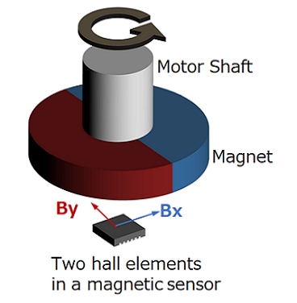

# 2. Game Design Experiments and player interaction evalutation

## Finding a suitable component for capturing rotational data

Knowing we wanted to incorporate rotation as a core mechanic in our game, we began evaluating the available hardware that could output rotational data. While potentiometers can be used for this purpose, our prior experience with them revealed several limitations. Most notably, they do not support full 360-degree rotation and cannot loop continuously. Additionally, they provide noticeable physical resistance during rotation, which we felt would negatively impact the player experience, especially if we wanted the motion to feel smooth and uninterrupted. If some physical resistance to what the player rotates was desirable, we concluded that it would be preferable to have that resistance be added by a separate element so we would have greater control over level of resistance and the end user experience.

We next considered rotary encoders, which offer continuous rotation and more stable angular position data. We discovered that there are two main types: incremental and absolute. Absolute encoders maintain their position even when powered off, while incremental encoders only report changes in motion, meaning they often require a homing routine to establish a known starting point. We also found that most rotary encoders include detents. Tactile clicks that give feedback during rotation. While this is ideal for applications like volume control, it was unsuitable for our needs. Although detentless encoders are available (or existing ones can be modified to remove the detents) we remained concerned about both physical resistance and accuracy. AS rotary encoders have a fixed resolution, determined by the number of lines or gaps on an internal disc used to block or pass light to a photosensor.

To address the physical resistance issue, we considered designing our own custom version of a rotary encoder. The concept involved evenly placing magnets around the edge of a rotating disc and using a Hall effect sensor beneath it to detect fluctuations in magnetic strength. This setup would allow the central shaft to rotate smoothly via bearings, avoiding unwanted resistance.
While researching the feasibility of this approach, we came across magnetic encoders, specifically the AS5600. A magnetic encoder uses a diametrically magnetized magnet which is a magnet with north and south poles on opposite sides of its flat face. This magnet is placed above the encoder chip, which houses two Hall effect sensors; one for each pole. By comparing the magnetic field strength from both sensors, the encoder can accurately determine rotational position. Magnetic encoders are highly accurate, don’t require a physical connection to the object being rotated which means no added physical resistance and are relatively inexpensive.

*Figure 1: [Magnetic Encoder Diagram Source](https://www.akm.com/global/en/products/rotation-angle-sensor/tutorial/magnetic-encoder/)*

The only issue with using the magnetic encoder is that they must be placed centrally along with the magnet so we could not have a central shaft. We solved this issue by instead using a “lazy Susan” type bearing which left the middle free.

## Statement of attribution
