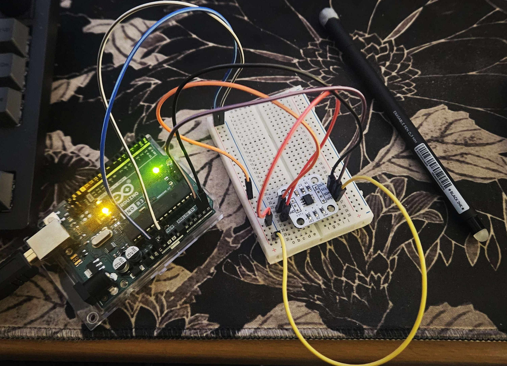
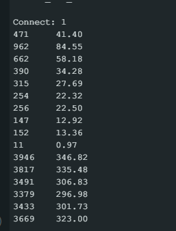
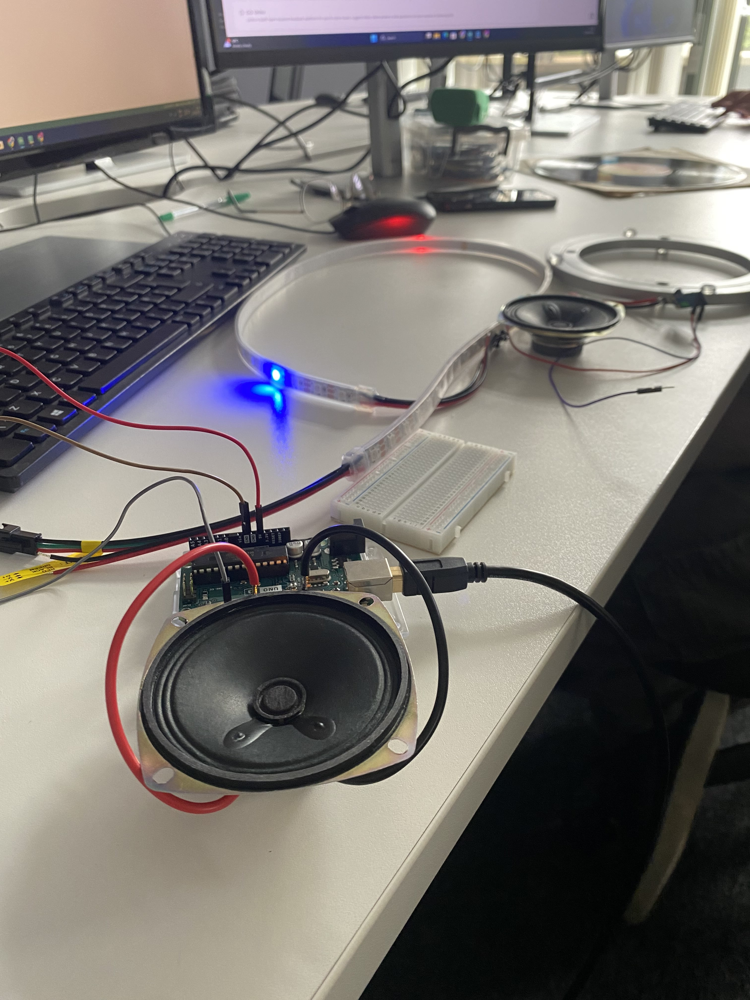

# 2. Game Design Experiments and player interaction evalutation

## Finding a suitable component for capturing rotational data

Knowing we wanted to incorporate rotation as a core mechanic in our game, we began evaluating the available hardware that could output rotational data. While potentiometers can be used for this purpose, our prior experience with them revealed several limitations. Most notably, they do not support full 360-degree rotation and cannot loop continuously. Additionally, they provide noticeable physical resistance during rotation, which we felt would negatively impact the player experience, especially if we wanted the motion to feel smooth and uninterrupted. If some physical resistance to what the player rotates was desirable, we concluded that it would be preferable to have that resistance be added by a separate element so we would have greater control over level of resistance and the end user experience.

We next considered rotary encoders, which offer continuous rotation and more stable angular position data. We discovered that there are two main types: incremental and absolute. Absolute encoders maintain their position even when powered off, while incremental encoders only report changes in motion, meaning they often require a homing routine to establish a known starting point. We also found that most rotary encoders include detents. Tactile clicks that give feedback during rotation. While this is ideal for applications like volume control, it was unsuitable for our needs. Although detentless encoders are available (or existing ones can be modified to remove the detents) we remained concerned about both physical resistance and accuracy. AS rotary encoders have a fixed resolution, determined by the number of lines or gaps on an internal disc used to block or pass light to a photosensor.

To address the physical resistance issue, we considered designing our own custom version of a rotary encoder. The concept involved evenly placing magnets around the edge of a rotating disc and using a Hall effect sensor beneath it to detect fluctuations in magnetic strength. This setup would allow the central shaft to rotate smoothly via bearings, avoiding unwanted resistance.
While researching the feasibility of this approach, we came across magnetic encoders, specifically the AS5600. A magnetic encoder uses a diametrically magnetized magnet which is a magnet with north and south poles on opposite sides of its flat face. This magnet is placed above the encoder chip, which houses two Hall effect sensors; one for each pole. By comparing the magnetic field strength from both sensors, the encoder can accurately determine rotational position. Magnetic encoders are highly accurate, don’t require a physical connection to the object being rotated which means no added physical resistance and are relatively inexpensive. The only issue with using the magnetic encoder is that they must be placed centrally along with the magnet so we could not have a central shaft. We solved this issue by instead using a “lazy Susan” type bearing which left the middle free.

*Figure 1: [Magnetic Encoder Diagram Source](https://www.akm.com/global/en/products/rotation-angle-sensor/tutorial/magnetic-encoder/)*

Once we purchased a magnetic encoder we referred to the data sheet for correct wiring and other usage such as the purpose of its different registers. We temporarily attached the magnet to the end of a pen using blue tac so we could more easily rotate the magnet over the sensor for testing. We found that our values were more inconsistent than we would have liked and that the margin of error for having the magnet and the sensor centered was very small. We remedied this by switching from a 6mm to a 8mm magnet. We utilized the status registers of the as5600 which gave feedback on the magnitude of the magnet strength to dial in thee optimal distance the magnet should be from the sensor.

*Figure 2: AS5600 Wiring*

*Figure 3: Raw angle and converted angle output from AS5600*

## Providing player with feedback

We knew it would be important to give the player as much feedback about the game as possible so that meant having audio and real time displaying of information like the score. So, we experimented with different speaker and display configurations. In the picture below you can see us testing out a speaker that was provided to us, however in that image we are connecting the speaker directly. We did this initially because it was simpler, but we later added an amp to give us a louder and clearer sound. We additionally added a potentiometer so we could adjust the sound, which is important so each player can adjust it to a level they feel is comfortable.

*Figure 3: Testing of spekaer and LED strip*

For the displays, we was fairly certain that showing just a few digits per display would be sufficient, so a 4-digit seven-segment display seemed like a reasonable choice. We purchased two such displays, but due to not thoroughly reading the datasheet and some poor planning, we overlooked the fact that these displays communicated via I2C and required the Arduino’s SDA and SCL pins. The Arduino Uno only has one set of these pins and they were already in use by the magnetic encoder. Even if they weren’t, we couldn’t connect more than one display to the same I2C bus without additional hardware.
As a result, we had to find an alternative segment display with a different communication method. We settled on a TM1637 seven-segment display, which can be controlled using just two general-purpose digital pins.

## TinkerCad/Software Testing

Before investing time in physical assembly, we chose to develop and test some of the software using TinkerCad. In the video below, you can see our code in action as it randomly turns LEDs on and off along a NeoPixel ring. The LEDs also flash to visually represent the time remaining before they switch off and a sound is played when they do so.

https://github.com/user-attachments/assets/089dc2bd-f79f-490e-a3c2-a9a0c502b18c

## Statement of attribution
-Chloe: Did initial software testing/coding in TinkerCad and primarily responsible for research into different encoder types, specifically the magnetic encoder
-Alex and Ethan: Took lead on audio and display setup/testing
