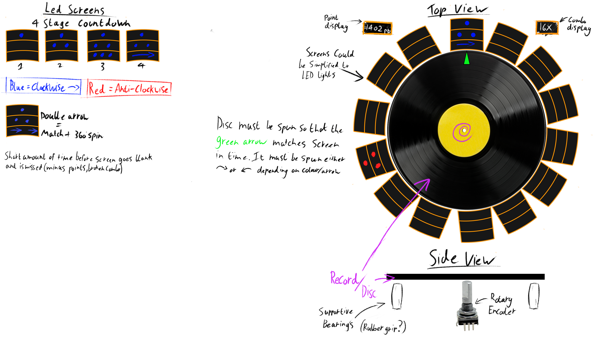
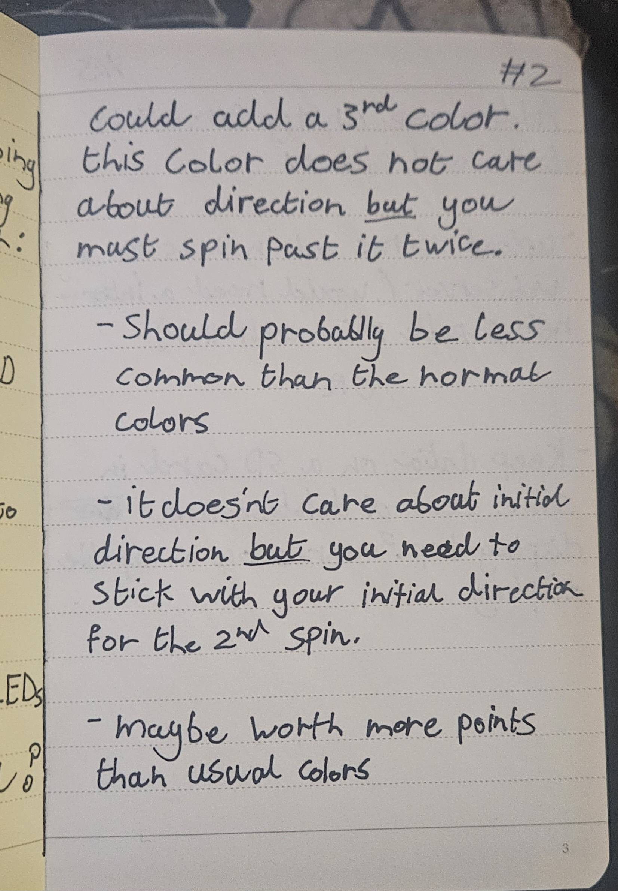

### 3. Game design ideas, leading up to the selected game design. Images of pencil drawings make excellent illustrations.

We initially bounced around a few vague game concepts, but none of them had time to develop into anything substantial, because we quickly locked onto our core idea early on in the process. The main mechanic was relatively simple and took inspiration from the back-and-forth spinning motion often seen on DJ decks.
In our game, the player spins a physical disc or record, aiming to align a marker on the disc with specific positions around its edge. At these positions, a light would have a certain colour which corresponds to a direction: one for clockwise, the other for counterclockwise. Based on the colour shown, the player must spin the disc in the correct direction to reach the corresponding target point. If they got to the position fast enough before it decayed and travelled in the correct  direction they would score points. We hoped this mechanic would encourage rapid, responsive input and create an engaging physical interaction loop.

Below is an early sketch of the game concept, created to ensure the entire team had a shared understanding of the idea. 

*Figure 1: Inital Concept Sketch*

The sketch includes generic screens to represent the positions the player needs to move to. These screens were in place for a few reasons:

Firstly, a single screen could display multiple pieces of information, such as the colour indicating the direction and arrows to signify a double spin, as shown in the sketch. Secondly, our initial design aimed for the player to reach the target position exactly at the end of the countdown. However, we later refined the concept, shifting the objective to simply reaching the target position within a set time limit. Despite this change, we wanted to retain the idea of double spins, as we felt it added some good variety and encouraged more dynamic player movement, contributing to a potential flow state during gameplay. To accommodate this, we introduced a third colour. Unlike the others, this colour doesn’t indicate a direction (clockwise or counterclockwise); instead, it signals that the player must perform a double spin to complete the action.

*Figure 2: Notes on possible additon of a third colour type*
## Statement of attribution
- Chloe: Created initial concept and accompanying sketch. Also created the notes seen.
- Whole Team: Contributed ideas that totalled up  to become the final game concept.
